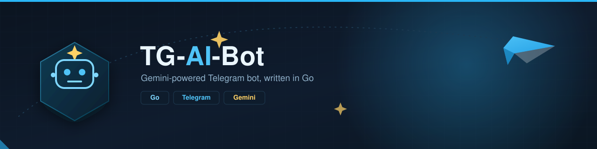

<h1 align="center">



[](https://deepwiki.com/rukiamuq-hard/TG-Ai-Bot)

</h1>
A Telegram bot written in Go that integrates with Google's Gemini AI to provide conversational AI capabilities and chat summarization.

## Features

*   **Conversational AI**: Interact directly with the Gemini 1.5 Flash model using the `/Gemini` command.
*   **Contextual Memory**: The bot maintains a history of your last 20 interactions to provide context-aware responses.
*   **Chat Summarization**: Use the `/ChatLogs` command to get an AI-generated summary of recent messages in the chat.
*   **Persistent Storage**: Conversation history and chat logs are stored locally in a SQLite database (`ChatHistory.db`).
*   **Customizable AI Prompt**: Modify the `prompt.txt` file to define the AI's personality, rules, and response style.

## Architecture

The bot is built with Go and utilizes several key components:

*   **`gopkg.in/telebot.v4`**: A framework for building Telegram bots in Go.
*   **Google Gemini API**: Provides the generative AI capabilities.
*   **SQLite**: A self-contained, serverless SQL database engine used for storing all conversation data.
*   **`godotenv`**: Manages environment variables for API keys and tokens.

### Project Structure

```
├── cmd/
│   ├── .env                          # (User-created) API keys and tokens.
│   ├── ChatHistory.db                # SQLite database file, created on first run.
│   ├── main.go                       # Main application entrypoint.
│   └── prompt.txt                    # System prompt for configuring the AI's behavior.
├── deployments/
│   └── docker/
│       ├── docker-compose.yml
│       └── Dockerfile
├── docs/
│   └── TgAiBot.svg                   # Architecture/project diagram.
├── internal/
│   ├── ai/
│   │   ├── ai.go                     # Gemini API client setup.
│   │   ├── chatlog.go                # AI request logic for chat log summarization.
│   │   └── gemini.go                 # AI request/response logic for /Gemini.
│   ├── app/
│   │   └── app.go                    # Application wiring/bootstrap.
│   ├── handler/
│   │   ├── database.go               # Telegram handlers for storing/retrieving messages.
│   │   ├── gemini.go                 # Telegram handler for the /Gemini command.
│   │   └── handler.go                # Handler struct and shared setup.
│   ├── models/
│   │   └── request.go                # Shared request/data models.
│   ├── repository/
│   │   ├── database/
│   │   │   ├── chatlog.go            # SQLite chat log storage.
│   │   │   ├── context.go            # SQLite conversation context storage.
│   │   │   └── database.go           # SQLite connection/setup.
│   │   └── mongodb/
│   │       ├─── mongodb.go            # MongoDB repository struct and shared setup.
│   │       └─── chatlog.go            # MongoDB storing/reading chatlog table
│   └── service/
│       ├── ai.go                     # AI-related service logic.
│       ├── chatlog.go                # Chat log service logic.
│       ├── context.go                # Context/history service logic.
│       └── service.go                # Service struct and shared setup.
├── .gitignore
├── go.mod
├── go.sum
└── README.md
```

## Setup and Installation

1.  **Clone the repository:**
    ```sh
    git clone https://github.com/rukiamuq-hard/TG-Ai-Bot.git
    cd TG-Ai-Bot
    ```

2.  **Create a configuration file:**
    Create a file named `.env` on cmd/:. This file will store your secret keys.

3.  **Add API keys to `.env`**
    You will need a Telegram Bot token and a Google Gemini API key.
    ```env
    TOKEN="<YOUR_TELEGRAM_BOT_TOKEN>"
    AI_TOKEN="<YOUR_GEMINI_API_KEY>"
    ```

4.  **Install dependencies:**
    ```sh
    go mod tidy
    ```

5.  **Run the bot:**
    Navigate to the `cmd` directory and run the main file.
    ```sh
    cd cmd
    go run main.go
    ```
    The bot will start, create a `ChatHistory.db` file if one doesn't exist, and begin polling for messages.

## Usage

Once the bot is running and added to a Telegram chat, you can use the following commands:

### Conversational AI

To chat with the Gemini AI, use the `/Gemini` command followed by your message. The bot will remember your conversation history for that chat.

**Example:**
`/Gemini Hello, what is the capital of France?`

The bot will reply, and you can continue the conversation by sending another `/Gemini` command.

### Chat Summarization

To get a summary of recent chat activity, use the `/ChatLogs` command. You can optionally specify the number of recent messages to summarize. If no number is provided, it defaults to 200.

**Example (summarize the last 50 messages):**
`/ChatLogs 50`

**Example (summarize the last 200 messages):**
`/ChatLogs`

The bot will send the chat logs to the Gemini AI and return a concise summary of the conversation. Note that all non-command messages sent in the chat are logged to the database for this feature.
